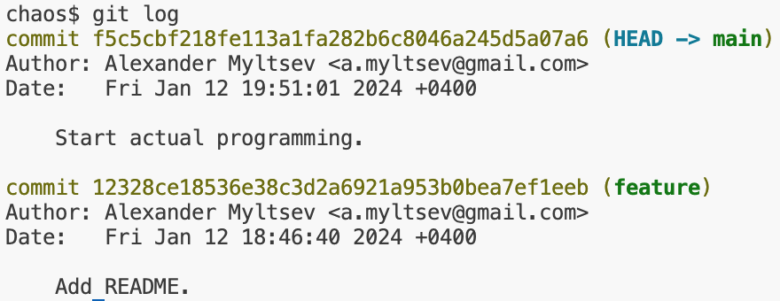
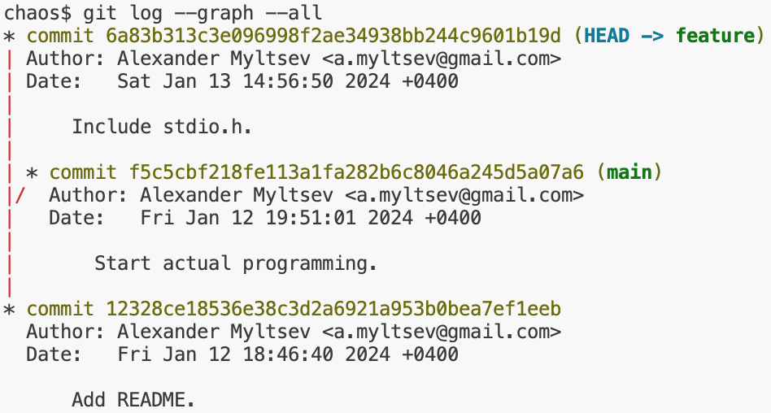

# `git`

```
$ whatis git | grep stupid
git(1)                   - the stupid content tracker
```

[xkcd, объясняющий, как устроена лекция](https://xkcd.com/1597/)

## Tracking work on projects

Создадим *репозиторий* — директорию, в которой будет храниться исходный код нашего проекта:
```shell
~$ mkdir chaos
~$ cd chaos
chaos$ git init -b main
Initialized empty Git repository in /home/myltsev/chaos/.git/
```

Напишем для нашего проекта README и сохраним его с помощью git:
```
chaos$ echo 'A project to develop a new operating system.' >README
chaos$ git add README
chaos$ git commit -m 'Add README.'

[main (root-commit) 12328ce] Add README.
 1 file changed, 1 insertion(+)
 create mode 100644 README
```

Так началась история нашего проекта:
```
chaos$ git log

commit 12328ce18536e38c3d2a6921a953b0bea7ef1eeb (HEAD -> main)
Author: Alexander Myltsev <a.myltsev@gmail.com>
Date:   Fri Jan 12 18:46:40 2024 +0400

    Add README.
```

Добавим ещё файл, чтобы в истории проекта было два разных записанных момента:
```
chaos$ touch main.c
chaos$ git add main.c
chaos$ git commit

[main f5c5cbf] Start actual programming.
 1 file changed, 0 insertions(+), 0 deletions(-)
 create mode 100644 main.c
```

## Beautiful tree model

Посмотрим, как именно git хранит содержимое нашего файла. Он приписывает спереди
к содержимому `"blob ДЛИНА\0"` и берёт от результата хэш SHA-1, а потом
складывает содержимое в соответствующий файл на диске:

```
chaos$ echo -e 'blob 45\0A project to develop a new operating system.' | sha1sum
e750a68af1f2f3712d7f43ad5d64a8d363b2568f  -

chaos$ ls .git/objects/e7
50a68af1f2f3712d7f43ad5d64a8d363b2568f

chaos$ python3 -c 'import zlib; print(zlib.decompress(open(".git/objects/e7/50a68af1f2f3712d7f43ad5d64a8d363b2568f", "rb").read()))'
b'blob 45\x00A project to develop a new operating system.\n'
```

Таким образом, git использует content-addressable storage: данное содержимое
файла всегда хранится под одним и тем же именем. Директория будет храниться как
список имён файлов с указанием хешей их содержимого:

```
chaos$ git cat-file -p bd452a89d490ea711965f9688cc60559afd25e33
100644 blob e750a68af1f2f3712d7f43ad5d64a8d363b2568f    README
100644 blob e69de29bb2d1d6434b8b29ae775ad8c2e48c5391    main.c
```

Коммит (записанный момент в истории) хранится как ссылка на корневую директорию
и набор метаинформации (имя автора, метка времени, описание коммита,
идентификатор родительского коммита и др.):
```
chaos$ git cat-file -p HEAD
tree bd452a89d490ea711965f9688cc60559afd25e33
parent 12328ce18536e38c3d2a6921a953b0bea7ef1eeb
author Alexander Myltsev <a.myltsev@gmail.com> 1705074661 +0400
committer Alexander Myltsev <a.myltsev@gmail.com> 1705074661 +0400

Start actual programming.
```

Таким образом, объекты в хранилище, ссылаясь друг на друга,
образуют ациклический направленный граф (DAG).

У нас в репозитории сейчас два коммита,
но один из них имеет специальное значение: он «самый актуальный»,
соответствует состоянию рабочей копии и станет родителем
следующего коммита. Этот коммит будем называть головным (`HEAD`).

Скорее всего нам потребуется в разные моменты времени считать головным разные
коммиты — например, мы хотим работать над несколькими задачами, переключаясь
между ними, и каждой задаче соответствует своя последовательность вносимых
изменений. Понятно, как это сделать: запишем идентификаторы этих коммитов в файлы с
понятными именами в директории `heads` и дадим пользователю возможность
обращаться к коммитам по этим именам.

Посмотрим, какие `heads` есть сейчас в нашем репозитории:
```
$ ls .git/refs/heads
main
$ cat .git/refs/heads/main
f5c5cbf218fe113a1fa282b6c8046a245d5a07a6
```

А вот какой head на самом деле является сейчас головным коммитом:
```
$ cat .git/HEAD
ref: refs/heads/main
```

Каждый `head`-коммит вместе с цепочкой его предшественников принято называть
*веткой* разработки (branch).

Теперь у нас есть возможность обращаться к коммитам как по их SHA1-хэшу,
так и по названиям из `heads`. Чтобы добыть хэш коммита по имени, есть утилита
`git rev-parse`:

```
$ git rev-parse main
f5c5cbf218fe113a1fa282b6c8046a245d5a07a6
$ git rev-parse HEAD
f5c5cbf218fe113a1fa282b6c8046a245d5a07a6
```

На самом деле SHA1-хэш необязательно писать полностью — достаточно уникального префикса:

```
$ git rev-parse f5c5
f5c5cbf218fe113a1fa282b6c8046a245d5a07a6
```

Есть также нотация для обращения к родительским коммитам:

```
$ git rev-parse HEAD^  # ^ — первый родитель
12328ce18536e38c3d2a6921a953b0bea7ef1eeb
$ git rev-parse HEAD~1  # ~n — n-тый прародитель
12328ce18536e38c3d2a6921a953b0bea7ef1eeb
```

## Just memorize these shell commands

### branches
Создадим дополнительную ветку разработки из предыдущего коммита:
```
$ git checkout -b feature HEAD^
Switched to a new branch 'feature'
```

Теперь у нас две ветки, из которых активна ветка `feature`:
```
$ git branch
* feature
  main

$ ls
README
```
Как видно, в этом коммите ещё нет файла `main.c`.

С помощью `git checkout` можно переключаться между ветками:
```
chaos$ git checkout main
Switched to branch 'main'

chaos$ ls
README main.c
```

Сейчас история коммитов выглядит так:


Переключимся на ветку `feature` и сделаем там новый коммит:
```
$ git checkout feature
Switched to branch 'feature'

$ echo '#include <stdio.h>' >main.c

$ git add main.c

$ git commit -m 'Include stdio.h.'
[feature 6a83b31] Include stdio.h.
 1 file changed, 1 insertion(+)
 create mode 100644 main.c
```

Теперь у нас есть две ветки, которые не являются предками
друг друга (diverging branches):


### index

В рабочей копии могут быть файлы, которые git не отслеживает, —
например, объектные, исполняемые и временные файлы.
Кроме того, не все изменения в отслеживаемых файлах обязаны
включаться в следующий коммит.

Чтобы подготовить содержимое следующего коммита, в `git` есть
*индекс* (index или *staging area*). Получается такой маршрут:

1. Правим файлы в рабочей копии (`vim`).
2. Копируем изменения в индекс (`git add` и др.).
3. Создаём коммит с содержимым индекса (`git commit`).

Попробуем сделать изменения, но не добавлять их в индекс,
а сразу сделать новый коммит:
```
$ echo '#include <stdlib.h>' >>main.c

$ git commit
On branch main
Changes not staged for commit:
  (use "git add <file>..." to update what will be committed)
  (use "git restore <file>..." to discard changes in working directory)
        modified:   main.c

no changes added to commit (use "git add" and/or "git commit -a")
```

Наши изменения сейчас есть только в рабочей копии, но не в индексе:


Добавим их в индекс и создадим новый коммит:
```
chaos$ git add main.c

chaos$ git diff --cached --stat
 main.c | 1 +
 1 file changed, 1 insertion(+)

chaos$ git commit -m 'Include stdlib.h.'
[main 16b1dc9] Include stdlib.h.
 1 file changed, 1 insertion(+)
```

Можно добавлять в индекс не все изменения в файле,
например, с помощью интерактивной команды `git add -p`
(она будет спрашивать вас отдельно про каждое изменение).

Восстановить содержимое индекса из `HEAD` можно
с помощью `git restore --staged [-p]`.

Все изменения в отслеживаемых файлах можно закоммитить
с помощью `git commit -a`.

### merging
Для слияния изменений в разных ветках имеется команда `git merge`.
Попытаемся учесть в `main` изменения, сделанные в `feature`.

```
$ git merge feature
Auto-merging main.c
CONFLICT (add/add): Merge conflict in main.c
Automatic merge failed; fix conflicts and then commit the result.
```

git не знает, как объединить изменения, сделанные в двух ветках.
Поэтому он оставляет в файле `main.c` маркеры конфликта,
а сам файл в индексе помечен как unmerged:

```
chaos$ cat main.c 
««««««« HEAD
#include <stdlib.h>
=======
#include <stdio.h>
»»»»»»» feature

chaos$ git status
On branch main
You have unmerged paths.
  (fix conflicts and run "git commit")
  (use "git merge --abort" to abort the merge)

Unmerged paths:
  (use "git add <file>..." to mark resolution)
        both added:      main.c

no changes added to commit (use "git add" and/or "git commit -a")
```

Чтобы завершить слияние, нужно отредактировать unmerged
файлы и добавить в индекс их правильные версии, а затем
создать коммит:
```
$ vim main.c 
$ git add main.c
$ git commit
[main 3a4c639] Merge branch 'feature'
```

Созданный коммит является слиянием (merge commit),
то есть имеет больше одного родителя:
```
$ git show
commit 3a4c6391190b85c8c4f9d19177d464b0acce5b36 (HEAD -> main)
Merge: 16b1dc9 6a83b31
...
```

`git log --graph` отображает это соответствующим образом:


Попробуем теперь сделать обратное слияние: добавить
в feature изменения, сделанные в main.

```
$ git checkout feature
Switched to branch 'feature'

chaos$ git merge main
Updating 6a83b31..3a4c639
Fast-forward
 main.c | 1 +
 1 file changed, 1 insertion(+)
```

Поскольку `feature` была предком `main`, слияние произошло
более простым способом — `feature` теперь просто является синонимом
`main`:


Такой способ слияния называется *перемоткой* (fast forward).
Нового коммита при этом не создаётся.

### remotes
