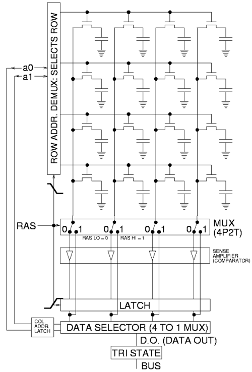
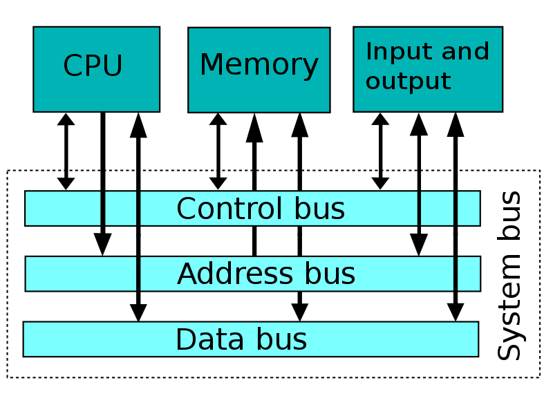

## Обращения к памяти
Сохранить значение регистра eax по адресу 0x40100,
а потом загрузить обратно в регистр ebx:
```x86asm
    mov [0x40100], eax
    mov ebx, [0x40100]
```

(При этом мы используем 4 байта по адресам
0x40100, 0x40101, 0x40102, 0x40103.)

Положить в память по адресу 0x40100 4-байтное целое число
0x1543:
```x86asm
    mov dword ptr [0x40100], 0x1543
```

Как правило, мы используем в качестве адресов метки:
```x86asm
    .global main
main:
    mov edi, [rip+x]
    call writei32
    call finish

x:  .int 43
```

Не любой адрес в памяти доступен для чтения и тем более записи:
```x86asm
    .global main
main:
    inc [rip+x]
    call finish

x:  .int 43
```
При попытке исполнения инструкции `inc` операционная система
остановит программу с сообщением «Segmentation fault»,
поскольку эти данные нельзя менять.

## Секции .data и .bss
Любые байты, порождаемые ассемблером,
записываются в одну из *секций* исполняемого
файла. По умолчанию это секция `.text`, в которой
ожидается машинный код и которая недоступна для записи.

Данные можно положить в секцию `.data`:
```x86asm
    inc [rip+x]

    .data
x:  .int 43

    .text
    call finish
```

Обратите внимание, что ассемблер собирает вместе содержимое каждой
из секций: в примере выше инструкция `call` окажется в памяти
(и в исполняемом файле)
сразу после `inc`.

Есть также секция .bss, в которую можно положить только нулевые байты:
```x86asm
    .bss
z:  .int 0
    .int 0
    // .int 83  // would be an error
```

Typical memory layout:
```
           ┌──────────────────┐    Executable file
0x00...0000│//////////////////│   ┌───────────────┐
           │//////////////////│   │ headers       │
           ├──────────────────┤   ├───────────────┤
           │.text   (read and │   │.text          │
           │         execute) │   │               │
      rip─►│                  │   │               │
           │                  │   │               │
           │                  │   │               │
           ├──────────────────┤   ├───────────────┤
           │.data   (read and │   │.data          │
           │         write)   │   │               │
           ├──────────────────┤   └───────────────┘
           │.bss    (read and │
           │         write)   │
           │                  │
           ├──────────────────┤
           │//////////////////│
           │//////////////////│    /// = unmapped region
           │//////////////////│          (inaccessible memory)
           │//////////////////│
           │//////////////////│
           │//////////////////│
      rsp─►│stack             │
           │                  │
           │                  │
           │                  │
           │                  │
           ├──────────────────┤
           │//////////////////│
0xff...ffff│//////////////////│
           └──────────────────┘
```

Бывают read-only данные (например, тексты сообщений программы),
для них есть секция `.rodata`. Эта секция не имеет собственной
директивы, поэтому нужно воспользоваться директивой `.section`:
```x86asm
    .section .rodata
pi_digits:
    .byte 3,1,4,1,5,9,2,6
```
(На практике вместо `.rodata` константные данные часто кладут в `.text`.)

## Endianness

x86 — little endian:
```x86asm
    // 0x40100:  00 00 00 00  00 00 00 00
    mov dword ptr [0x40100], 0xabcdef
    // 0x40100:  ef cd ab 00  00 00 00 00
```
Младший байт по младшему адресу в памяти.

## Расширение

[movzx](https://www.felixcloutier.com/x86/movzx),
[movsx](https://www.felixcloutier.com/x86/movsx).

```x86asm
    movzx edi, al  // zero-extend, расширение нулями
    movsx edi, al  // sign-extend, расширение знаковым битом
    cwd  // convert word to double-word: sign-extend ax to dx:ax
    cdq  // convert double-word to quad-word: sign-extend eax to edx:eax
    cqo  // convert quad-word to octo-word: sign-extend rax to rdx:rax
```

## Умножение и деление

[mul](https://www.felixcloutier.com/x86/mul),
[imul](https://www.felixcloutier.com/x86/imul),
[div](https://www.felixcloutier.com/x86/div),
[idiv](https://www.felixcloutier.com/x86/idiv).

## Разные способы адресации в x86

```x86asm
    mov eax, [rip + x]      // rip-relative адресация: загрузили 4 байта по адресу x
    mov eax, [rip + x + 4]  // загрузили следующие 4 байта

    lea rsi, [rip + x]      // (положили в rsi адрес массива x)
    mov eax, [rsi + 4]      // косвенная адресация

    mov rdi, 17
    // загружаем в eax 18-й элемент массива
    // (адрес которого rsi + rdi*4)
    mov eax, [rsi + rdi*4]

    // делаем то же самое
    mov eax, [rip + x + 17*4]

    .bss
x:  .skip 4 * 100

    .data
x5: .int x + 4*5      // в x5 лежит адрес шестого элемента массива x
```

Общий вид обращения к памяти:

`BREG + IREG*SCALE + OFFSET`

Здесь 
BREG — базовый регистр, IREG — индексный регистр,
умножаемый на SCALE (SCALE может быть 1, 2, 4 или 8),
OFFSET — непосредственно заданное смещение.

RIP-relative адресация поддерживает только OFFSET:
```asmx86
    mov eax, [rip + 10]
    mov eax, [rip + x]   // неудачная нотация, но уж какая есть
```

## Стек
Writable область памяти, которая используется
как стек :-). Стек на x86 растёт *вниз* (от старших адресов к младшим).
На верхушку стека (первый занятый байт) указывает регистр rsp.

Скопировать верхушку стека (первые 8 байт) в регистр `rax`:
```x86asm
    mov rax, [rsp]
```

Для того, чтобы класть данные на стек и выталкивать их оттуда,
есть специальные инструкции:
```x86asm
    push %rax  // то же, что sub rsp, 8; mov [rsp], rax
    pop %rax   // то же, что mov rax, [rsp]; add rsp, 8
```

Инструкция `push` одна из немногих, которые могут обратиться
к двум адресам памяти сразу:
```x86asm
    .data
x:  .quad 1900

    .text
    push [rip + x]  // взять 8 байт из памяти по адресу x
                    // и положить их в стек, то есть тоже в память
```

Можно пользоваться памятью выше `rsp`, если вы знаете,
что там что-то есть. Например, если вы положили в стек
два 64-битных числа, их можно оттуда читать и там изменять:
```x86asm
    push 6
    push 7

    // теперь стек выглядит так:
    //    0700 0000 0000 0000 0600 0000 0000 0000 ...
    //    ↑ rsp

    mov rax, [rsp + 8] // загрузили в rax число 6
    inc qword ptr [rsp]        // теперь на верхушке стека лежит число 8
```

*Ниже* `rsp` можно использовать только ближайшие 128 байт памяти (так называемая «красная зона»):
```
    mov [rsp-8], rax    // OK
    mov [rsp-160], rax  // не ОК, эту память могут неожиданно поменять
```

Инструкция `push rsp` кладёт на стек
то значение `rsp`, которое было до её исполнения
(не уменьшенное на 8).


## Подпрограммы

Когда в ДЗ просят сдать «функцию» или «подпрограмму»:
1) исполнение начинается с метки с именем подпрограммы;
2) метка должна быть `.global`;
3) чтобы вернуть управление в проверяющую программу,
   используйте инструкцию `ret`;
4) можно свободно менять значения регистров rax, rdi, rsi, rdx, rcx, r8–r11;
4) если меняете значения других регистров,
   сохраняйте их в стек и потом восстанавливайте.

Например, если вас просят написать функцию `foobar`,
и вам нужно менять регистры `r12` и `r13`:
```x86asm
    .global foobar
foobar:
    push r12
    push r13
    ... // делаем что просят, можем портить r12 и r13
    pop r13 // восстанавливаем в обратном порядке
    pop r12
    ret
```
(Подробнее в следующей лекции.)

## Устройство ОЗУ
Мы уже видели SRAM — память на триггерах.

Основную часть памяти компьютера составляет DRAM:


Процессор и память общаются посредством *шины* (bus):

