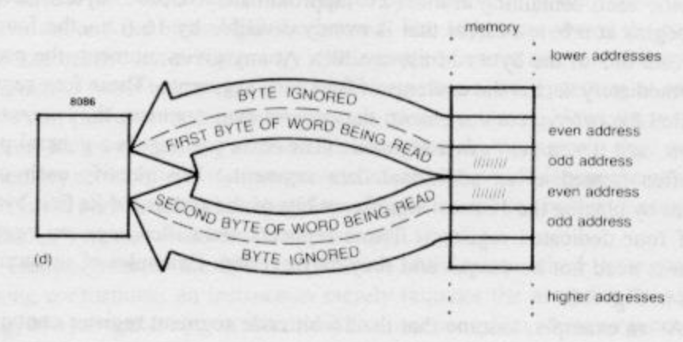

## Переход по адресу в регистре

```x86asm
{{#rustdoc_include code/absolute-jump.S}}
```

Или так:
```x86asm
{{#rustdoc_include code/functable.S}}
```

## Выравнивание



Как правило, *лучше*, чтобы многобайтовые
обращения к памяти были *выровнены* (aligned).

```x86asm
    // начало секции лежит по максимально выровненному адресу (кратному 16)
    .byte 1
    .int 1    // эти 4 байта лежат по адресу, не кратному 4

    .balign 4 // byte align: здесь добавит 3 байта нулей
    .int 1    // эти 4 байта лежат по адресу, кратному 4

    .balign 2 // не добавит ничего
    .short 1
```


## Подпрограммы

Мы хотим переиспользовать код — вызывать
одну и ту же последовательность инструкций из разных
точек программы.

```x86asm
double_eax:
    sal eax, 1
    jmp ...  // куда?
    

    ...
    jmp double_eax
    // хотим продолжить исполнение здесь

    ...
    jmp double_eax
    // или здесь
```

Некоторые архитектуры решают это с помощью
специального регистра для адреса возврата.
Если бы такой был в x86, подпрограммы могли бы
выглядеть так:
```x86asm
double_eax:
    sal eax, 1
    jmp return_address_register
    

    ...
    lea return_address_register, [rip + 1f]
    jmp double_eax
1:

    ...
    lea return_address_register, [rip + 1f]
    jmp double_eax
1:
```

Но в x86 принято адрес возврата класть на стек:
```x86asm
double_eax:
    sal eax, 1
    pop rdx         // достаём из стека адрес возврата
    jmp rdx         // и переходим по нему
    

    ...
    lea rax, [rip + ret1]
    push rax        // кладём в стек адрес возврата
                    // (адрес следующей инструкции после jmp)
    jmp double_eax  // и переходим на начало подпрограммы
ret1:

    ...
    lea rax, [rip + ret2]
    push rax
    jmp double_eax
ret2:
```

Для этих операций (вход в подпрограмму и возвращение из неё)
есть специальные инструкции `call` и `ret`:
```x86asm
double_eax:
    sal eax, 1
    ret             // достаём из стека адрес возврата
                    // и переходим по нему
    

    ...
    call double_eax // кладём в стек адрес возврата
                    // (адрес следующей инструкции после call)
                    // и переходим на начало подпрограммы

    ...
    call double_eax
```

В подпрограмме важно соблюдать баланс инструкций
`push` и `pop`, чтобы не промахнуться мимо адреса возврата.

## Соглашения о вызовах

Чтобы разные люди (и компиляторы) могли совместно разрабатывать
подпрограммы, им нужно договориться, как передавать
в подпрограмму параметры, как возвращать результат и какие
регистры подпрограмма не будет портить. Такие договорённости
называются *соглашениями о вызовах* (calling conventions).

Стандартное соглашение на нашей платформе (Linux/x86)
называется [cdecl](https://en.wikipedia.org/wiki/X86_calling_conventions#System_V_AMD64_ABI):
* первые 6 параметров передаются в регистрах
  rdi, rsi, rdx, rcx, r8, r9;
* прочие параметры передаются в стеке, причём лежат в памяти
  «по порядку» (адрес увеличивается вместе с номером аргумента);
* параметры удаляет из стека тот, кто их туда положил
  (то есть вызывающая функция);
* возвращаемое значение в регистре rax
  (а 128-битное — в паре `rdx:rax`);
* callee-saved регистры: rbx, rsp, rbp, r12–r15;
* caller-saved регистры: все остальные;
* перед инструкцией call указатель стека выровнен на 16 байт.

Вооружённые этим знанием, мы теперь можем вызывать функции
на Си и быть ими вызваны:

```x86asm
    // int foobar(int a, int b)

    mov edi, a
    mov esi, b
    call foobar

    // возвращённое значение лежит в %eax
```

```x86asm
    // возможная реализация функции foobar (return a + b)
    .global foobar
foobar:
    // сейчас стек выглядит так: return_address ...
    mov eax, edi
    add eax, esi
    ret
```


## Локальные переменные

Под них мы выделяем место на стеке:
```x86asm
baz:
    sub rsp, 8     // выделили себе 8 байт, в которых неизвестно что
    push 0        // выделили себе ещё 8 байт, в которых 0
    // сейчас стек выглядит так: 0  ?  return_addr ...
```

Чтобы обращаться к локальным переменным через rsp, придётся
помнить, на сколько мы этот rsp сместили:
```x86asm
    mov [rsp + 8], 42
```

## Стековый кадр

Принято при входе в функцию сохранять rsp в регистре
rbp (base pointer), а сам rbp перед этим класть на стек:
```x86asm
quux:
    push rbp
    mov rbp, rsp

    /*
    stack layout:  oldrbp  return_addr ...
                   ↑ rbp
    
    local var 1: [rbp - 8]
    local var 2: [rbp - 16]
    */

    ...

    mov rsp, rbp
    pop rbp
    ret
```

Стековый кадр (stack frame):
```
    │   ...         │
    ├───────────────┤
    │  saved rbp    │ ◄─┐
    │               │   │
    │               │   │
    │               │   │
    │  return addr  │   │
    ├───────────────┤   │
rbp→│  saved rbp    │ ──┘
    │  local1       │
rsp→│  local2       │
    │               │
```

## Текст (не тот, который `.text`, а настоящий)

Кодировка [ASCII](https://en.wikipedia.org/wiki/ASCII#Character_set).
```x86asm
greeting:
    .byte 'H'  // то же, что .byte 0x48
    .byte 'i'  // то же, что .byte 0x69
    .byte ' '
    .ascii "guy"
    .asciz "s"  // то же, что .ascii "s\0"

    .asciz "Hi guys"  // ещё раз та же последовательность байт
```
