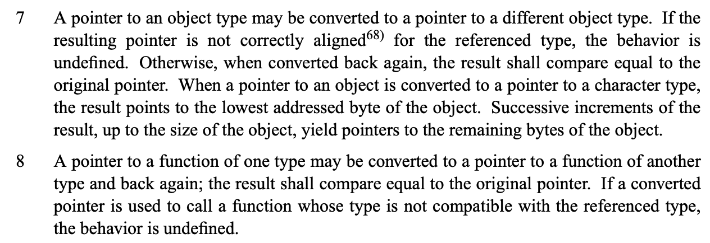
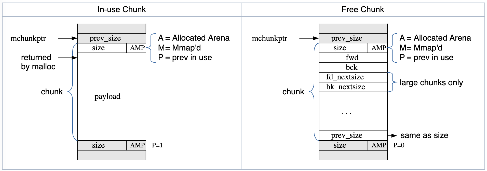

## Typedef and qualifiers

```c
typedef int my_int_32_t;
typedef struct foobar {
    ...
} foobar;

const char *s1, *s2;
const int x = 70;
const char * const msg = "hi";
volatile int counter;
```

## Function pointers

```c
int strcmp(const char *a, const char *b);

// This does not work:
// int *comparator(const char *a, const char *b) = strcmp;

int (*my_comparator)(const char *a, const char *b) = strcmp;

// OK, let's typedef it
typedef int (*comparator_t)(const char *, const char *);

comparator_t comparator = strcmp;

int result1 = (*comparator)("Roger", "David");
int result2 = comparator("Nick", "Rick");

qsort(..., comparator, ...);
```
---
Trying to typedef functions directly does not work
```c
// int (comparator2)(const char *a, const char *b) = strcmp;

typedef int (comparator_t2)(const char *, const char *); // useless

// comparator_t2 comparator2 = strcmp;
// ^ error: function ‘comparator2’ is initialized like a variable
```
---
GCC integer overflow builtins
```c
bool __builtin_add_overflow (type1 a, type2 b, type3 *res);
bool __builtin_sub_overflow (type1 a, type2 b, type3 *res);
bool __builtin_mul_overflow (type1 a, type2 b, type3 *res);

char a = 100, b = 200, c;
int d;
__builtin_add_overflow(a, b, &c);
// -> true == overflow

__builtin_add_overflow(a, b, &d);
// -> false == no overflow
```
---
## Printing fixed-size types

The problem:
```c
uint32_t var;
printf("%...", var); // ???
printf("%d", var);   // fails on Win16
printf("%ld", var);  // fails on 64-bit systems

scanf("%...", &var); // even worse
```
---
String literal joining
```c
char *longstring = "There is no pain, "
                   "you are receding";
```
---
```c
#include <inttypes.h>

#define PRId32 "d"
#define PRIu32 "u"
#define PRId64 "ld"
#define PRIu64 "lu"
#define SCNi32 "i"
#define SCNiPTR "li"

uint32_t var;
uintptr_t ptr;
printf("%" PRId32 "\n", var);
scanf("%" SCNi32 "\n", &var);
scanf("%" SCNiPTR "\n", &ptr);
```

---
## Dynamic memory

---
```c
// man malloc
#include <stdlib.h>

// C11, POSIX
void *malloc(size_t size);
void free(void *ptr);
void *calloc(size_t nmemb, size_t size);
void *realloc(void *ptr, size_t size);

// nonstandard
void *reallocarray(void *ptr, size_t nmemb, size_t size);
```

---
```c
enum {buf_size = 20};

char *buf = malloc(buf_size);
// type conversion is automatic
// buf == NULL -> allocation error
// otherwise, contents of buf undefined here

strcpy(buf, "arc de Triomphe");
buf[0] = 'A';
...

free(buf);   // OK
//free(buf); // UB -- double free
buf = NULL;
free(buf);   // OK, free is a no-op here
```
-i--
```c
int *array = calloc(30, sizeof(*array));
```

Similar to, but not the same thing as:
```c
int *array = malloc(30 * sizeof(*array));
// check for NULL
memset(array, 0, 30 * sizeof(*array));
```
---

```c
// same as malloc(100)
void *ptr = realloc(NULL, 100);

// don't do this
// ptr = realloc(ptr, 200);

void *tmp = realloc(ptr, 200);
if (!tmp) {
    perror("realloc");
    free(ptr);
    return;
} else {
    ptr = tmp;
}
```

---
Dynamic array
```c
struct DynArray {
    size_t size;
    size_t capacity;
    int *ptr;
} array = {};

void append(struct DynArray *arr, int value) {
    if (arr->size + 1 > arr->capacity) {
        size_t newcap = 2 * (arr->capacity + 1);
        int *tmp = realloc(arr->ptr, newcap * sizeof(*tmp));
        if (!tmp) {
            // Handle allocation error
        }
        arr->ptr = tmp;
        arr->capacity = newcap;
    }
    arr->ptr[size++] = value;
}
```
---
Better yet:
```c
int *tmp = reallocarray(arr->ptr, newcap, sizeof(*tmp));
```
Where `reallocarray` is not available:
```c
size_t size;
if (__builtin_mul_overflow(newcap, sizeof(arr->ptr[0]), &size)) {
    // Handle overflow
}
int *tmp = realloc(..., size);
```
---
## Example: delete from list
This won't work:
```c
struct List {
    int data;
    struct List *next;
};

void remove(struct List *list, int key) {
    while (list && list->data != key) {
        list = list->next;
    }
    if (!list) {
        return;
    }
    free(list);
    list = list->next; // use after free
    // no way to update the pointer
}
```
---
```c
struct List {
    int data;
    struct List *next;
};

void remove(struct List **list, int key) {
    while (*list && (*list)->data != key) {
        list = &(*list)->next;
    }
    if (!*list) {
        return;
    }
    struct List *next = (*list)->next;
    free(*list);
    *list = next;
}
```

---
## Example: BST insertion
```c
struct TreeNode {
    int data;

    struct TreeNode *left;
    struct TreeNode *right;
};

int main(void) {
    struct TreeNode *root = NULL;
    ...
}
```
---
```c
struct TreeNode **descend(struct TreeNode **root, int key) {
    while (*root && (*root)->data != key) {
        if ((*root)->data > key) {
            root = &(*root)->left;
        } else {
            root = &(*root)->right;
        }
    }
    return root;
}

void insert(struct TreeNode **root, int key) {
    struct TreeNode **where = descend(root, key);
    if (!*where) {
        *where = calloc(1, sizeof(struct TreeNode));
        ...
        (*where)->data = key;
    }
}
```
---
Sometimes fixed-size buffers are inconvenient:
```c
char buf[100];
// scanf("%s", buf); <- banned
scanf("%99s", buf);
...
snprintf(buf, sizeof(buf), "%d bottles of beer on the wall", 50)
...
fgets(buf, sizeof(buf), stdin);
// gets(buf);  <- banned from C11
```
---
```c
char *buf = NULL;
scanf("%ms", &buf); // POSIX
...
free(buf);
```

```c
char *buf = NULL;
asprintf(&buf,
         "%d little Soldier Boys "
         "went out to dine", 10); // GNU / BSD
...
free(buf);
```
```c
// ssize_t getline(char **lineptr, size_t *n, FILE *stream);
char *line = NULL;
size_t linesize = 0;
getline(&line, &linesize, stdin); // POSIX
...
free(line);
```
---



---


---


---
Strict aliasing


---
Union types
```c
union U {
    uint32_t u;
    float f;
    char bytes[4];
}

assert(sizeof(union U) == 4);
```
---
Glibc malloc



---
* C++'s `new` uses malloc

* Python: malloc + reference counting + GC

* Go, Java: garbage collection

---
* Overcommit. OOM killer.
* Memory leaks, double free, use after free.
---
Address sanitizer

```bash
gcc -fsanitize=address myprog.c
```

---
Valgrind

```
Valgrind is in essence a virtual machine using just-in-time
(JIT) compilation techniques, including dynamic
recompilation. Nothing from the original program ever gets
run directly on the host processor. Instead, Valgrind first
translates the program into a temporary, simpler form called
Intermediate Representation (IR), which is a
processor-neutral, SSA-based form. ...

...usually, code run with Valgrind ...runs at 20% to 25% of
the speed of the normal program.
```
