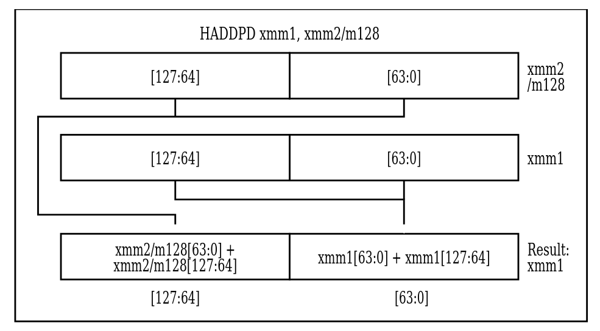
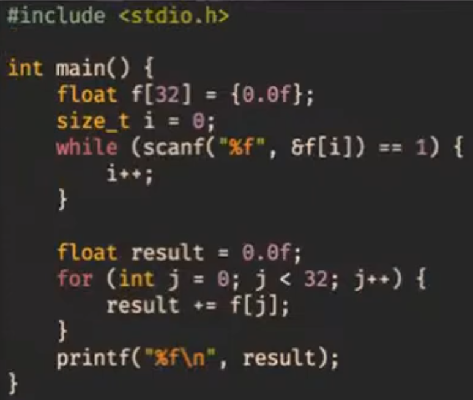
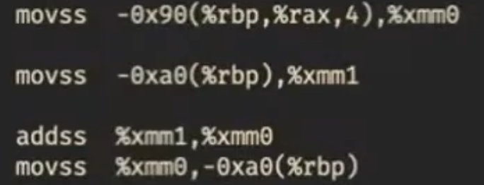

# Вещественные числа

## Формат представления числа

Для хранения и обработки вещественных чисел большинство процессоров используют формат [IEEE 754](https://en.wikipedia.org/wiki/IEEE_754). Есть удобный [калькулятор](https://www.h-schmidt.net/FloatConverter/IEEE754.html).
Рассмотрим, как устроен формат, на примере 32-битных вещественных чисел:


Биты числа разделены на 3 группы:

1. **Знаковый бит**. Один, старший бит. 0 – число положительное (или нуль), 1 – отрицательное или нуль.
2. **Показатель степени**. 8-битное целое число, занимает биты с 23-го по 30-ый. Означает *степень двойки*, на которую будет домножаться основаная часть числа, записанная далее.
3. **Дробная часть**. 23-битное целое число, содержащее *значащие биты* вещественного числа.

Обозначим знаковый бит как `sign`, беззнаковое значение показателя степени как `exp`,
а беззнаковое значение дробной части как `frac`.

## Значение числа в разных случаях

Итак, как числа получаются с помощью этих компонент? Есть несколько случаев:

* Если \\( 0 < exp < 255 \\), число называется **нормализованным**. В таком случае
оно равно \\( -1^{sign} × 2^{exp - 127} × 1,frac_2 \\),
то есть знак и степень двойки домножаются на число, у которого в целой части
стоит 1, а двоичную дробную часть составляют 23 бита frac.

Т. к. мы хотим представлять как большие по модулю числа, так и близкие к нулю, то
степень двойки должна принимать как положительные, так и отрицательные значения.
Поэтому мы вычитаем из неё 127 (смещение), так степень станет принимать значения
[-126; 127] (почему не могут быть -127 и 128, увидим ниже).


* Если exp=0, число называется **денормализованным**. В этом случае
его значение
\\( -1^{sign} × 2^{-126} × 0,frac \\).


* Если `exp`=255 и `frac`=0, число называется **бесконечностью** и обозначается `+inf` или `-inf` в зависимости от знака.


Бесконечности нужны для обозначения очень больших по модулю чисел, для
представления которых не достаточно 8 бит показателя степени.

* Если `exp`=255 и `frac`!=0, число называется **нечислом** и обозначается "NaN".  Знак при этом ни на что не влияет.


Как видно, различных NaN-ов бывает много. Все они нужны для обозначения
неопределённости в результате выполнения арифметических операций, например, inf-inf
или sqrt(-3).

Итого, числовая прямая выглядит так: 

## Особенности формата

* Есть два нуля: +0 и -0. +0 имеет все нулевые биты, то есть является нулём как 32-битное целое число.

* **Сравнение**: наименьшее положительное нормализованное число
(\\( 2^{-126} * 1,0\\)) больше наибольшего денормализованного числа
(\\( 2^{-126} * 0,111..1\\)).
Также любое положительное нормализованное число с меньшим `exp`
меньше любого положительного нормализованного числа с большим `exp`. Таким
образом, действительно, все положительные денормализованные числа меньше всех
положительных нормализованных, а нормализованные расположены в порядке
показателя степени.

* Такой же **порядок остаётся, если сравнивать** битовые представления вещественных чисел **как знаковые целые числа**! (Кроме NaN-ов).
* Вещественные числа **становятся более разреженными при увеличении** их модуля.
  Чем число ближе к нулю, тем оно ближе к ближайшему к нему другому
  представимому числу. А точнее, денормализованные числа и нормализованные
  с `exp`=1 идут через одинаковый
  шаг. Нормализованные числа с `exp`=2 идут через удвоенный шаг, с `exp`=3 --
  через учетверённый, и так далее. Иллюстрация распределения чисел:
  

## Арифметические операции

* **Умножение** числа на **степень двойки**. Достаточно прибавить/вычесть из показателя степени (учитывая переполнения).
* **Умножение** двух чисел. Достаточно **сложить их показатели степени и перемножить мантиссы**.
При этом в мантиссе может также получиться число >= 2, тогда надо его нормализовать и прибавить 1 к показателю степени.
**Если мантисса** результата не влезает в `23` бита, её **надо округлить**. Если хвост < 1/2 или > 1/2, то округляется вниз или вверх, соответственно. Если хвост в точности 1/2, то округлять всегда в одну сторону плохо, т.к. при большом количестве последовательных операций может накопиться существенная погрешность. Поэтому в этом случае округляется к ближайшему чётному (то есть, если предыдущий бит равен 0, то вниз, если 1 -- вверх). Пример:
```
  |23 бита|           |23 бита|
1,01.....1101111 -> 1,01.....11   // хвост < 1/2, округляем вниз
  |       |           |       |
1,01.....0110011 -> 1,01.....10   // хвост > 1/2, округляем вверх
  |       |           |       |
1,01.....0010000 -> 1,01.....00   // хвост = 1/2, округляем вниз
  |       |           |       |
1,01.....0110000 -> 1,01.....10   // хвост = 1/2, округляем вверх
```
* **Деление** аналогично.
* **Сложение и вычитание**. Привести оба числа к одинаковому показателю степени, выполнить операцию, привести к нормализованному или денормализованному виду и округлить по правилам выше, если потребуется.

## Свойства арифметических операций

* При корректных арифметических операциях получается либо число, либо бесконечность.
* Сложение и умножение коммутативны
* Ассоциативности нет. Из-за округления в процессе выполнения операций могут получиться разные результаты. Например,
\\((3.14 + 2^{100}) - 2^{100} = 0\\), но
\\(3.14 + (2^{100} - 2^{100}) = 3.14\\).
Из-за этого, для сохранения точности выполнять операции стоит в определённом
порядке. Например, если хотим сложить массив вещественных чисел в одно число,
лучше всего делать это в порядке сортировки чисел по возрастанию модулей.

* У конечных чисел есть обратный элемент по сложению.
* Монотонность: \\(a\geq b \implies a+c\geq b + c\\), если нет переполнений и NaN-ов.

## Вещественные числа в C

### Типы и их особенности в C

В C есть типы *float*, *double* и *long double*. На нашей системе они имеют размер 4, 8 и 12 байт соответственно. В 64-битном формате `exp` занимает 11 бит, а `frac` -- 52. Некоторые гарантии на арифметику:

* f = -(-f) -- верно всегда.
* (d < 0) => (2d < 0) -- верно всегда, в том числе если получается `-inf`.
* (d > f) => (-f < -d) -- верно всегда
* d * d >= 0 -- верно всегда

Считая, что *int* также 32-битный, рассмотрим приведения типов:

* float -> double: преобразуется точно.
* double -> float: может потеряться точность или стать inf (если был большой по модулю показатель степени).
* int -> double: преобразуется точно, поскольку влезает в мантиссу.
* int -> float: будет округлён, если int большой по модулю и есть маленькие биты (не влезает в мантиссу).
* float/double -> int: дробная часть будет отброшена. Не определено, если целая часть не влезает в int.

### Работа с вещественными числами в C

Для наглядности далее будет полезно запускать такой код. Он выводит все части числа в удобном формате:
```c
#include <stdio.h>
#include <math.h>

#define CHECK(exp) printf(#exp " == %d\n", (exp))

int main() {
	union {
		float f;
		unsigned u;
	} uf;
	while (scanf("%f", &uf.f) == 1) {
		printf("f (%%e) = %e\n", uf.f);
		printf("f (%%f) = %f\n", uf.f);
		printf("f (%%g) = %g\n", uf.f);
		printf("f (%%a) = %a\n", uf.f);
		printf("u = %x\n", uf.u);
		printf("sign = %u\n", uf.u >> 31);
		printf("exp = %u\n", (uf.u >> 23) & 0xff);
		printf("frac = %x\n", uf.u & 0x7fffff);
		CHECK(fpclassify(uf.f));
		CHECK(isnan(uf.f));
		CHECK(isfinite(uf.f));
		CHECK(isinf(uf.f));
		CHECK(isnormal(uf.f));
	}
}
```
Спецификаторы printf:
* `%f`, `%e`, `%g` -- float/double в 10-ой системе счисления.
* `%a` -- float/double в 16-ой СС. Мантисса и показатель степени (c учётом смещения) разделаются символом `p`.
Например, `4.375` = `0x1.18p+2`.

Функции для работы с вещественными числами:
* `int fpclassify(float/double)` -- возвращает класс числа, то есть одно из следующих значений: `FP_NAN`, `FP_INFINITE`, `FP_ZERO`, `FP_SUBNORMAL`, `FP_NORMAL`.
* `int isnan(float/double)` -- является ли число NaN.
* `int isfinite(float/double)` -- является ли число не NaN и не бесконечностью.
* `int isinf(float/double)` -- 1, если +inf, -1, если -inf.
* `int isnormal(float/double)` -- является ли число нормализованным.

Чтобы использовать функции из `math.h`, необходимо компилировать программу с флагом `-lm`.

## Инструкции для работы с вещественными числами

У процессора есть отдельные регистры для обработки нескольких значений за одну инструкцию и, соответственно, отдельные инструкции для работы с этими регистрами.
Есть 128-битные регистры XMM0-XMM31. В них можно поместить, например, 2 double, 4 float, 4 int, 8 short и т.д. Также есть 256-битные регистры YMM0-YMM31, являющиеся расширениями соответствующих XMM (по аналогии с AX->RAX). Аналогично, есть их 512-битные расширения, называемые ZMM0-ZMM31.

Эти регистры исторически добавлялись в следующем порядке: XMM->YMM->ZMM. Инструкции для работы с YMM называются SSE, а для работы с ZMM -- AVX. Мы на курсе будем работать только с SSE.

SSE инструкции:
* `MOVAPD xmm1/m128 xmm2` -- положить два double, записанные в xmm1 (или в памяти) в xmm2. Если переклыдавем из памяти, она должна быть выровнена на 16 байт.
* `MOVUPD xmm1/m128 xmm2` -- то же самое, только нет требования к выравниванию. Работает дольше.
К счастью, и gcc при входе в функцию стек выравнивает на 16 байт, и *alloc выделяет память, выровненную на 16 байт, поэтому всегда можем использовать `MOVAPD`.
* `ADDPD xmm1/m128 xmm2` -- прибавить два double из xmm1 или из памяти к xmm2 поэлементно.
* `MOVSS e*x/m32 xmm2` -- загружает в младшие 32 бита xmm2.
* `HADDPD xmm1/m128 xmm2` -- выполняет "горизонтальное" сложение в двух числах отдельно и записывает в результат эти результаты подряд: 

Все регистры XMM caller-saved (не надо сохранять внутри функции).

## Как gcc компилирует работу с вещественными числами.

Посмотрим, как следующая программа выглядит при компиляции с разными оптимизациями:


1. Компилируем эту программу gcc без флагов оптимизации и в 32-битном режиме. Поскольку на 32-битной архитектуре мы не можем гарантировать, что процессор поддерживает SSE, то компилятор генерирует инструкции из устаревшего набора x87 (для сопроцессора). Мы с таким работать не хотим, поэтому идём дальше.
2. Соберём без `-m32` (то есть для 64-битной архитектуры). Получились SSE-инструкции, но пока что работающие с float-ми по-одиночке. 
3. Соберём с O3 и `-mavx -ftree-vertorize`. Так мы скажем компилятору, что доступны инструкции AVX, и чтобы он векторизовал операции. Но он почему-то всё равно не векторизует :(

Чтобы печатать float-ы через printf на 32-битной архитектуре, используются инструкции x87. А на 64-битной параметры типа float и double в printf передаются через регистры xmm. Подробнее не будем изучать.

## Алгоритм Кэхэна
Чтобы сложить много вещественных чисел более точно, можно использовать такой алгоритм, учитывающий ошибку округления:

```kotlin
function KahanSum(input)
    var sum = 0.0                 // Prepare the accumulator.
    var c = 0.0                   // A running compensation for lost low-order bits.

    for i = 1 to input.length do  // The array input has elements indexed input[1] to input[input.length].
        var y = input[i] - c      // c is zero the first time around.
        var t = sum + y           // Alas, sum is big, y small, so low-order digits of y are lost.
        c = (t - sum) - y         // (t - sum) cancels the high-order part of y; subtracting y recovers negative (low part of y)
        sum = t                   // Algebraically, c should always be zero. Beware overly-aggressive optimizing compilers!
    next i                        // Next time around, the lost low part will be added to y in a fresh attempt.

    return sum
```

Идея в том, что отдельно считаются неточная сумма больших по модулю чисел (переменная `sum`) и компенсация для накопленной ошибки округления (переменная `c`).
