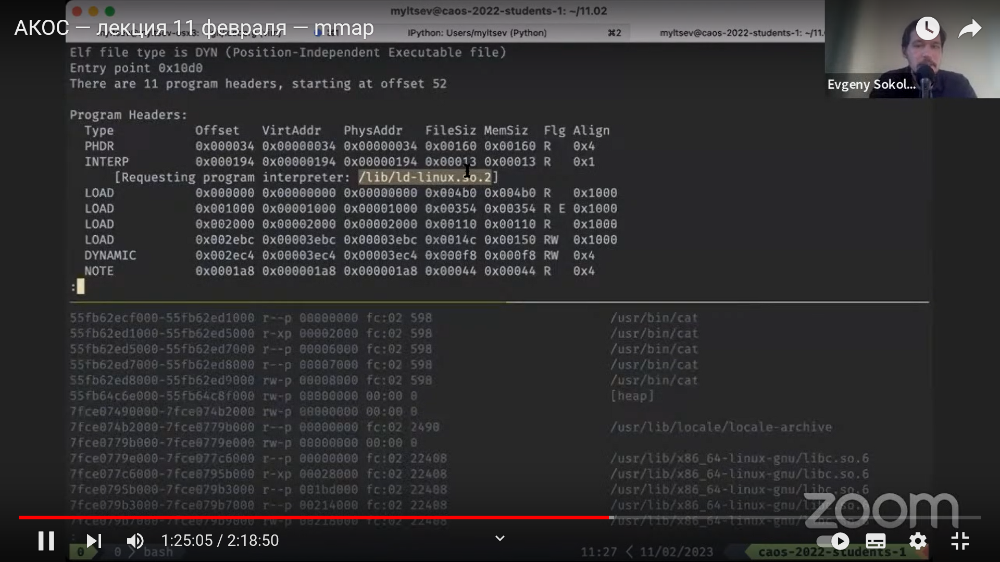
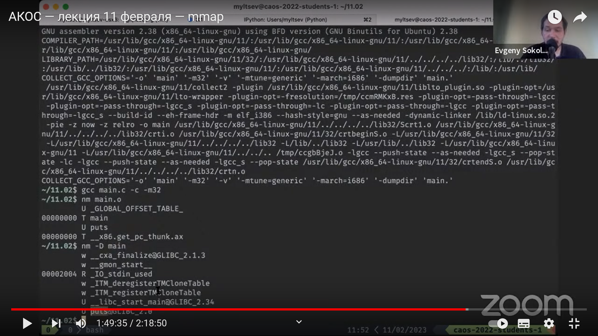
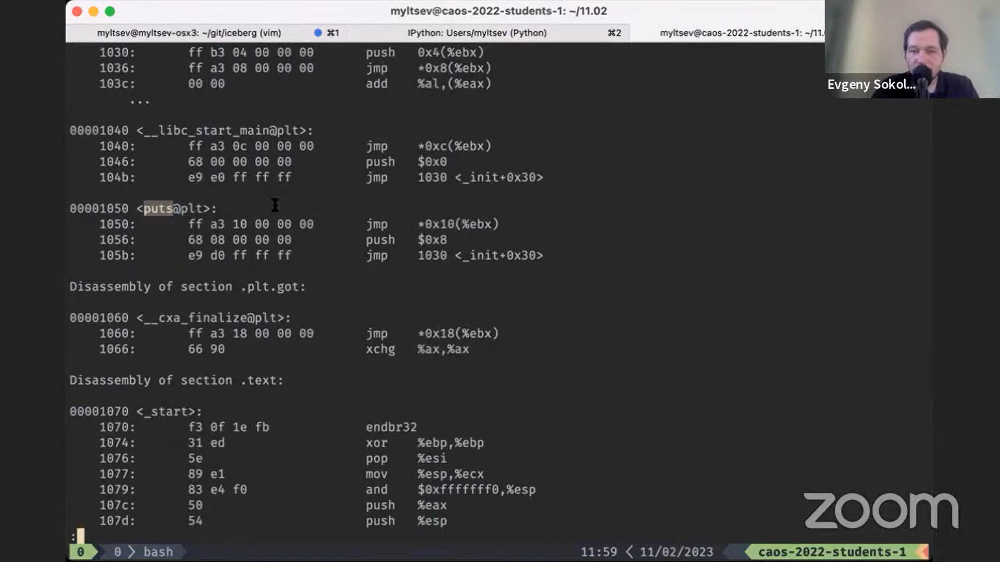

Привычная статическая компоновка с неперемещаемым исполняемым файлом (`-no-pie`):
* compile time: компилируем код, получая объектные файлы, которые предоставляют
  символы, которые в них определены,
  и требуют символов, которые в них используются;
* link time: во время компоновки объектных файлов в executable
  компоновщик разрешает (resolves) символы в их адреса
  и подставляет эти адреса в машинный код;
* runtime: executable требует, чтобы его секции загрузили в память
  по фиксированным адресам, и рассчитывает на это в своей работе.

Динамическая компоновка:
* link time: компоновщик оставляет некоторые символы неразрешёнными,
  но записывает в executable информацию о том, какие динамические
  библиотеки ему требуются для работы;
* runtime: динамический загрузчик разрешает используемые символы
  в их адреса, разыскивая символы в загруженных библиотеках.

### Как искать и загружать дополнительные библиотеки?

Мы не хотим, чтобы этим занималось ядро. Программа, которая этим занимается, называется динамический загрузчик.
Она должна исполняться в адресном пространстве той программы, в которой она загружается.

INTERP говорит, что нужно передать управление /lib/ld-linux.so.2

### Какие требования к коду разделяемых библиотек?

Что делать, если бинарник собирается по разным адресам памяти?
В случае с переменными (в отличие от переходов) мы имеем не перемещаемый код (который работает только по фиксированному
адресу памяти)

Чтобы код работал в разделяемой библиотеке и загружался в разных процессах по-разному, код должен быть перемещаемым.
Он не может обратиться по фиксированному адресу памяти - сначала он должен выяснить, где он находится в памяти, понять,
где лежат данные, к которым он хочет обратиться, а потом уже обращаться.

Есть один instruction pointer (регистр eip или rip), и на x86_32 мы не можем относительно него адресовать память, а на x86_64 можем.

Нужно предупредить компилятор, что у нас перемещаемый код.

Иначе компилятор обратится к переменной по адресу памяти.

Опция -D - показать динамические предоставляемые символы. (puts нет)

Мало просто загрузить код всех библиотек в адресное пространство, надо еще отыскать там все требуемые символы.

Мы хотим, чтобы секция .text была отображена в память read-only (так она во всех процессах будет в одних и тех же физических страницах памяти — экономия), поэтому
при релокации вытаскиваем в отдельную writable секцию, и вместо того, чтобы везде
вызывать функцию puts, мы вызываем соответствующее место plt. А уже в соответствующем месте можем сделать jmp на нужную
функцию. (на ее адрес в памяти)

Главный бинарник по умолчанию собирается с -fpie:

* более расслабленные требования к перемещаемому коду

* компилятору проще найти функции и переменные

Таким образом, механизм разделяемых библиотек предоставляет нам 2 важные вещи:

* код можно мапить в адресное пространство разных процессов
  * Таким образом экономится физическая и оперативная память.

* динамическое связывание более слабое
  * Мы можем менять реализации функций и обновлять эту реализацию во всех программах, которые будут запущены на компьютере.
(например, в случае новой версии стандартной библиотеки языка C)

Дополнительные темы для обсуждения:
* ABI compatibility;
* LD_PRELOAD.
