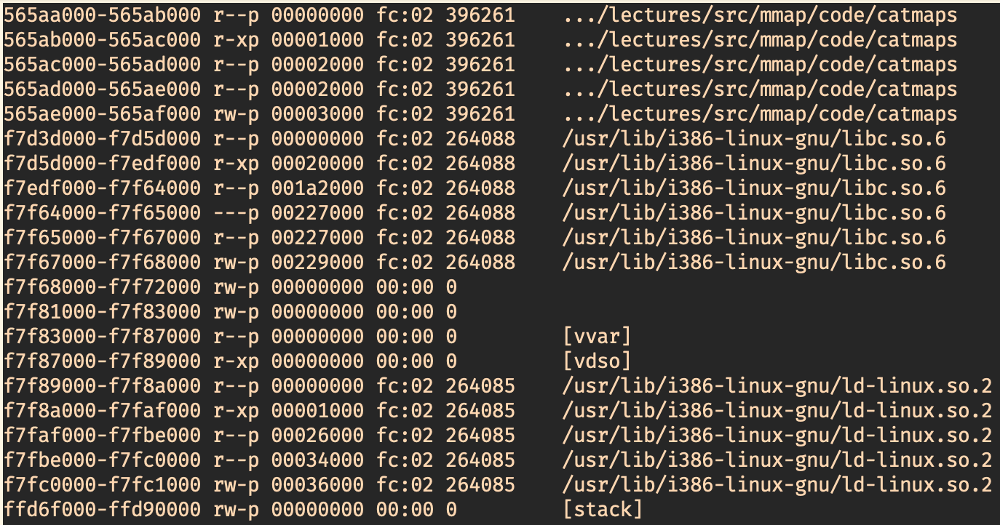
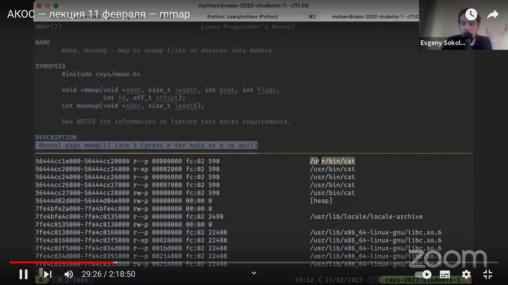

# Страничная виртуальная память

Механизм _виртуальной памяти_: программа оперирует _виртуальными_
адресами оперативной памяти, отображением которых на _физическую_
память управляет операционная система.

Мы уже видели механизм сегментной виртуальной памяти, когда
виртуальный адрес является смещением относительно базы сегмента:
`phys_addr = virt_addr + segment_base`. Этот механизм устарел
и больше не применяется в современных процессорах.

Ему на смену пришёл механизм _страничной_ виртуальной памяти:
виртуальное и физическое адресные пространства делятся
на блоки определённого размера —
_страницы_, и каждая из виртуальных страниц может быть отображена на
произвольную физическую (или никуда не отображена).
Кроме того, страницы могут быть помечены как
недоступные для записи (read only) или доступные
только для ядра (supervisor only).

[См. картинку в статье про виртуальную память](https://en.wikipedia.org/wiki/Virtual_memory)

Очевидно, чтобы этот механизм работал, отображение (_трансляцию_) виртуальной
памяти на физическую должен осуществлять процессор.

Часть процессора, ответственная за трансляцию, обычно называется
«_memory management unit_» (MMU). Если программа обращается
к неотображённой или недоступной странице памяти либо пытается модифицировать
read-only память, то процессор возбуждает исключительную ситуацию
«_page fault_».

## Механизм страничной памяти на x86_32

Стандартный размер страницы — 4К (\\(2^{12} = 4096\\) байт).
x86 поддерживает страницы и большего размера, но мы не будем
ими пользоваться.

Если бы мы хранили отображение для каждой страницы в 32-битном
адресном пространстве, то потребовалось бы \\(4 * 2^{20}\\), то есть
4 МБ физической памяти на процесс. Чтобы сэкономить память,
отображение хранится несколько сложнее.

(Подробнее [на osdev.org](https://wiki.osdev.org/Paging#Page_Directory).)

При частом обращении к одним и тем же страницам памяти
хотелось бы сэкономить и на поиске по этой структуре данных.
Для этого существует кэш, который называется
_translation lookaside buffer_ — TLB.

(Все картинки украдены из Википедии.)

## Виртуальная память процесса в Linux

Ядро Linux для каждого процесса хранит собственную таблицу отображений
виртуальной памяти, на основе которой формирует таблицы страниц
для процессора.

По своему происхождению отображения бывают _анонимные_ и
_файловые_.

По поведению (при fork и при записи) отображения бывают private и shared.

Посмотрим в файл `/proc/self/maps`:

* первая колонка - диапазоны адресов виртуальной памяти (которыми пользуется программа)
* последняя колонка - из какого файла мы взяли этот кусок памяти
* буквы во второй колонке означают read, write, execute, private 
* третий столбец - смещение в файле
* дальше — номер устройства (диска) и номер файла на нём (inode)

Можно предположить, что операционная система, запуская бинарник и создавая ему виртуальную память, все отображенные
страницы складывает в таблицу страниц и отдает процессору.

Но на самом деле операционная система в своих внутренних структурах данных, относящихся к этому процессу, записывает,
что есть диапазон памяти с нужными битами доступа, который отображен на какой-то файл на диске, начиная с какого-то
смещения.
А в таблицу страниц ничего не кладет.

Когда программа пытается обратиться к не отображенной памяти, процессор генерирует исключение PageFold.
В этот момент, когда программе понадобилась какая-то из страниц памяти, которую ей пообещала операционная система,
процессор генерирует Page fault, и процессор его обрабатывает.
    
То есть пока память не потрогал, операционная система не будет с ней ничего делать.
Когда потрогал, операционная система выделяет эту страницу памяти, отдает ее тебе, обработав исключение, добавляет
отображение в таблицу страниц и программа исполняется дальше.

Память изначально заполнена нулями. Если потрогаем страницу памяти, которая находится внутри кучи, то она найдет для нее
физическую память, занулит ее и добавит ее в таблицу страниц. 

Но malloc не зануляет память.

A calloc не записывает нули, потому что свежая память, которую он получает, и так зануленная (это если calloc берёт новую память у ОС (с помощью mmap), а если выдаёт старую память, которую кто-то раньше освободил, то, конечно, сам и записывает туда нули).

mmap - системный вызов, обращение к операционной системе, что начиная со смещения offset отобразить файл fd по адресу
памяти addr, отображение длины lenght и есть флаги flags.

* MAP_SHARED - то, что мы пишем в отображённую на файлы память, записывается в эти самые файлы

* MAP_PRIVATE - не записывается

Cмотрим на вывод ./mmap textfile.txt

Отображение textfile.txt получилось размера 1 страницы (4 Кб в нашем случае), и меньше отображение быть не может.

Всегда получается целое количество страниц.

То есть размер отображения всегда кратен размеру страницы.
offset тоже должен быть кратен размеру страницы.

В режиме MAP_SHARED мы не знаем, когда у нас записываются изменения.

Чтобы синхронизировать, можно сделать msync.

Когда отображение нам больше не нужно, с помощью munmap, который принимает адрес, можем удалить отображение.

Мы постоянно используем минимальное количество оперативной памяти для тех страниц, которые не изменяются. 

Если наша программа не выполняется, а выполняются другие, которым нужна оперативная память, то отображние секции text 
выгрузится. Если программа запустится, то мы всегда сможем выгрузить отображение обратно с диска.

Редактировать бинарник просто так не получится: будет ошибка Text File busy.

Бывают анонимные отображения - получаем просто участок памяти, который инициализирован нулями.

(fd = -1, указываем MAP_ANONYMOUS)

