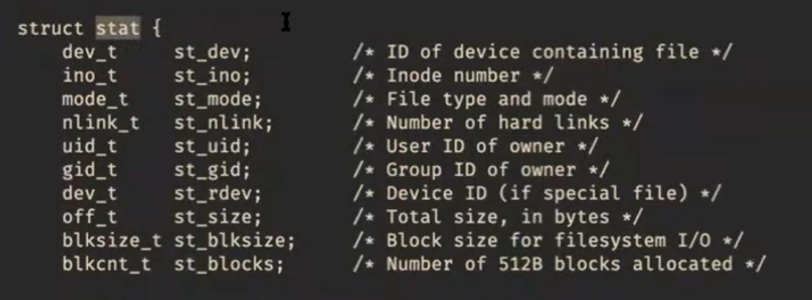

# Файловая система

### **Системный вызов stat**

```c
int stat(const char *pathname, struct stat *statbuf); // stat - структура с информацией о файле
```



Введя в терминал `stat filename`, можем получить информацию о размере файла, количестве блоков в нем, размере одного блока, времени доступа и др.


## **Разные типы файлов**

- Обычные файлы (regular) - последовательности байт
- Директории, в которых лежат другие файлы (в том числе директории)
- Символические ссылки
- Жесткие ссылки
- Каналы (fifo)
- Блочные устройства. Например, диск, куда можно писать блоками
- Символьные устройства. Например, терминал, куда можно читать и писать по одному символу

**Символическая ссылка** — специальный файл, который содержит путь к другому
файлу. Когда программа открывает символическую ссылку, она не показывает
содержимое файла, а открывает файл с названием, которое там записано. Если
переименуем файл, на который указывает ссылка, то символическая ссылка не будет
никуда показывать. `ln -s poem.txt poem2.txt` создаст символическую ссылку:


Все файлы на диске имеют номера, записанные в Inode. **Жесткая ссылка** появляется, когда разные имена файлов указывают на один Inode. `ln mary.txt poem.txt` создаст жесткую ссылку. mary.txt укажет на тот же Inode, что и poem.txt, и любые изменения в одном файле приведут к изменениям в другом. Если удалить один из файлов, то второй файл останется.

На Inode есть reference counter, показывающий, сколько имен ссылаются на это содержимое. Когда reference counter = 0, ОС удаляет файл. Если открыть файл, то его reference counter на это время увеличится.

```c
int stat(const char *file_name, struct stat *buf);
int lstat(const char *pathname, struct stat *statbuf);
int fstat(int fd, struct stat *statbuf); // Для работы с открытым файлом с помощью файлового дескриптора, а не пути
int unlink(const char *pathname); // Удаляет связь с Inode. Если pathname - последнее имя, которое указывало на Inode, то Inode удалится
```

Утилита `stat` дает нам информацию о типе файла. Если в `stat` передать имя символической ссылки, то вместо нее ОС подставит тот файл, на который указывает ссылка. Поэтому, чтобы узнать, является ли файл символической ссылкой, используем вызов `lstat`, который работает как `stat`, но передает информацию о самой символьной ссылке, не производя замену.

## **Директории**

Познакомимся с системными вызовами для работы с директориями.

```c
DIR *opendir(const char *name);
DIR *fdopendir(int fd);
struct dirent *readdir(DIR *dirp); // возвращает 0, если дошли до конца директории
```

В структуре dirent можно посмотреть inode number, имя, тип файла и др.


> Напишем программу myls, которая отображает содержимое некоторой директории
> 

```c
{{#rustdoc_include code/myls.c}}
```

```c
int link(const char *oldpath, const char *newpath); // делает ссылки
int symlink(const char *target, const char *linkpath); // делает символические ссылки
```