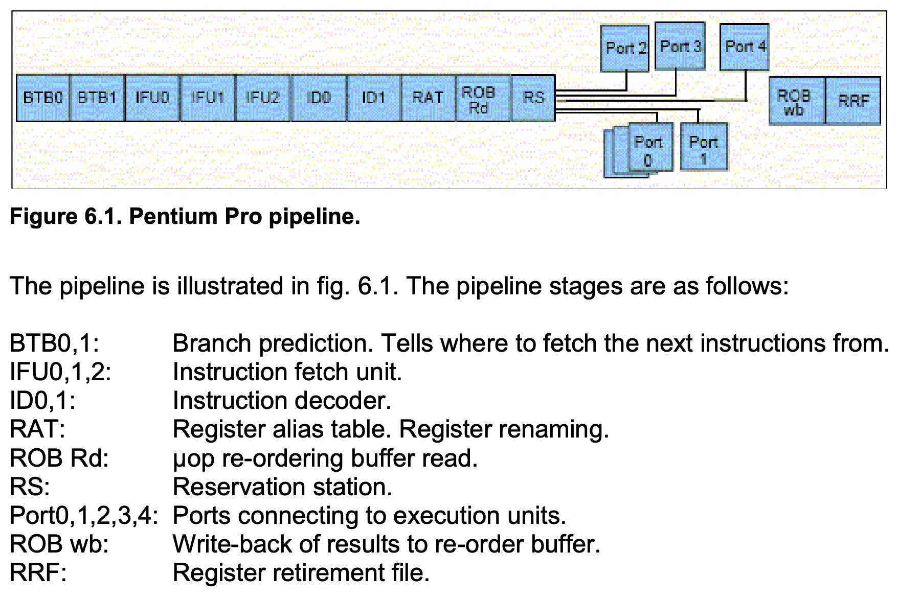

# Как работает CPU

## Classic RISC pipeline


[Эмулятор процессора архитектуры RISC-V](https://webriscv.dii.unisi.it/index.php)

Data hazard:
```
  li a1, 42         # a1 = 42
  add a2, a1, a1    # a2 = a1 + a1
```

Control hazard:
```
  j label           # unconditional jump
  add a1, a2, a3    # this instruction will be flushed
label:
  li a1, 42
```

## Real life

[Документация от Агнера Фога](https://agner.org/optimize/#manuals)

[Про микроархитектуру](https://agner.org/optimize/microarchitecture.pdf)

## Out-of-order execution
### µops

```x86asm
// ISA instructions → µops (names made up)

add [x], eax        → µload  tmp1, [x]
                      µadd   tmp1, eax
                      µstore [x], tmp1
```

```x86asm
mov eax, [mem1]
imul eax, 5
add eax, [mem2]  // fetch started before imul
mov [mem3], eax
```

### Register renaming

> Every time an
instruction writes to or modifies a logical register, the microprocessor assigns a new
temporary register to that logical register.

```x86asm
mov eax, [mem1]
imul eax, eax, 6
mov [mem2], eax

mov eax, [mem3]  // old value of eax dropped
add eax, 2
mov [mem4], eax  // eax retirement
```

## Branch prediction (предсказание переходов)
Predict whether branch is T (taken) or NT (not taken).

### Loop vs conditional
Stupid approach:
```x86asm
loop:
    ...
    jz loop   // T

    ...
    jz else   // NT
    ...
else:
```
Predict taken backwards, not taken forwards.

### Saturating counter
Store state for every branch: T ↔ Weak T ↔ Weak NT ↔ NT

### Return prediction
> A Last-In-First-Out buffer, called the return stack buffer,
remembers the return address every time a call instruction is executed, and it uses this for
predicting where the corresponding return will go. This mechanism makes sure that return
instructions are correctly predicted when the same subroutine is called from several
different locations.

See PDF for better methods.

## Pipeline (конвейер)
General idea: different stages of execution require different hardware,
so we can parallelize them.



[Sunny Cove pipeline](https://en.wikichip.org/wiki/intel/microarchitectures/sunny_cove#Pipeline)

Keywords:
* µop cache
* execution unit
* micro-op fusion (e.g. memory write: address calculation + data transfer)
* macro-op fusion (e.g. cmp + jz)
* stack engine (special handling of esp/rsp)

µop stages:
* queued in ROB (reorder buffer)
* executing
* retirement (register writeback etc.)

[Testing branch target prediction on different CPUs](https://blog.cloudflare.com/branch-predictor/)
